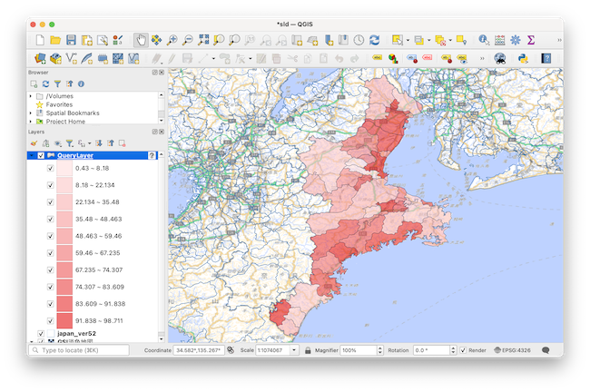
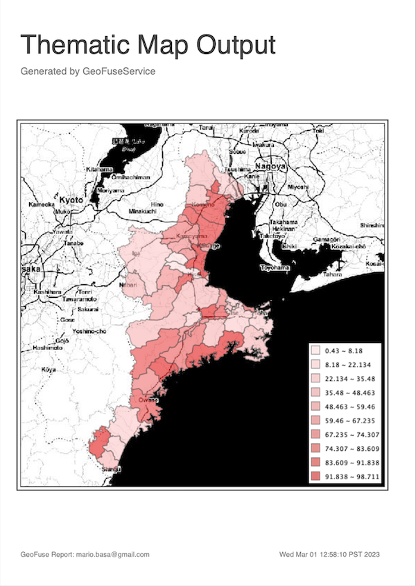
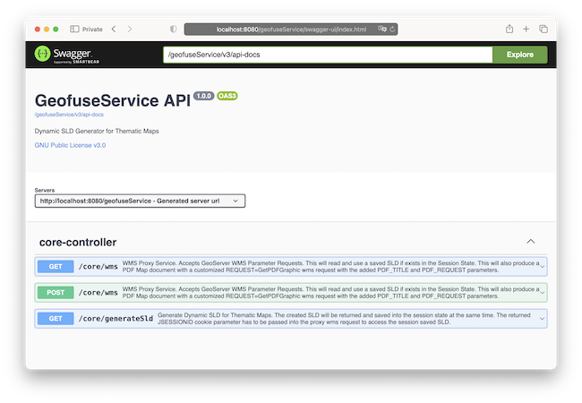

# GeoFuse Service



The Geofuse Service is a Dynamic OpenGIS® **Styled Layer Descriptor (SLD)** 
generator to create **Thematic Maps** based on the data and distribution 
parameters. The SLD created can be used with WMS servers or any other GIS 
application that uses SLD for its styling. 

### Core Services

GeoFuse Service consists of 2 core REST Services:

* generateSld - this generates the actual SLD based on the parameters passed, 
and returns the SLD and saves it as well into the Session State. The Cookie
**JSESSIONID** will be included that will contain the Session ID. 


* wms - this is a proxy WMS that will check for the existence of a generated
SLD in the Session State based on the **JSESSION** Session ID and use it as the
SLD_BODY parameter that will be sent to the actual WMS server. The benefit of 
this is that the SLD string (which can contain hundreds of lines) does not 
have to be passed for every WMS GetMap request. 


### PDF Output

The proxy WMS service includes non-standard WMS Requests to create a PDF report 
containing the Thematic Map. The non-standard wms requests are:

* REQUEST=GetPDFGraphic
* PDF_TITLE=< Title of PDF Report i.e. "Thematic Map Output" >
* PDF_NOTE=< Sub-Tile of PDF Report i.e. "Generated by GeoFuseService" >


Sample PDF Report Output :

  




### Installation and Deployment

Download the Latest Release of the **geofuseService.war** file. When using an 
Application Server such as Tomcat, just copy the war file into its `webapps`
directory. 

If deploying as a server-less application, run the application as:


```
java -jar geofuseService.war
```

The application can now be accessed as: 

```
http://localhost:8080/geofuseService/
```
   
### Service API Documentation

The API list and documentation can be found in its Swagger page:

```
http://localhost:8080/geofuseServer/swagger.html
```



### Building the Application

`Maven` will be needed to build the application from source. Once installed, 
just issue the following command:

```
mvn -DskipTests clean install
```

and the created geofuseService.war will be found in the target directory.
